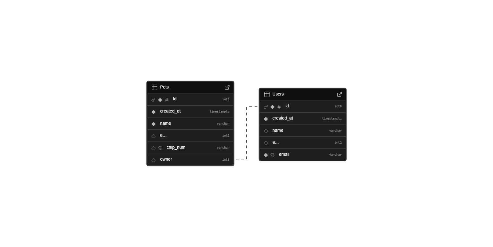
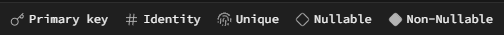

# Supabase Mini Project

A tiny project to practice Supabase basics: create an account, define two tables with a FK, add screenshots/diagram, and share the repo URL.

## Tasks

1. Create an account in **Supabase**.
2. Create two tables:
   - **Users**: `name`, `age`, `email`
   - **Pets**: `name`, `age`, `chip_num`, `owner` (FOREIGN KEY → `Users.id`)
3. Take screenshots of the configuration (or include the ER diagram).
4. Create a repository with this README and the images.
5. Share the repository URL.

---

## Schema diagram



## Legend


---

## Database schema (summary)

**users**
- `id` — `bigint` (identity, primary key)
- `created_at` — `timestamptz` (default `now()`)
- `name` — `varchar` (required)
- `age` — `smallint`
- `email` — `varchar` (**unique**, required)

**pets**
- `id` — `bigint` (identity, primary key)
- `created_at` — `timestamptz` (default `now()`)
- `name` — `varchar` (required)
- `age` — `smallint`
- `chip_num` — `varchar` (**unique**, required)
- `owner` — `bigint` (FK → `users.id`, recommended: **ON DELETE CASCADE**)

---

## (Optional) SQL you can paste in Supabase SQL Editor

```sql
create table if not exists users (
  id         bigint generated always as identity primary key,
  created_at timestamptz not null default now(),
  name       varchar not null,
  age        smallint,
  email      varchar not null unique
);

create table if not exists pets (
  id         bigint generated always as identity primary key,
  created_at timestamptz not null default now(),
  name       varchar not null,
  age        smallint,
  chip_num   varchar not null unique,
  owner      bigint not null,
  constraint pets_owner_fkey
    foreign key (owner) references users(id)
    on delete cascade
);

create index if not exists idx_pets_owner on pets(owner);
